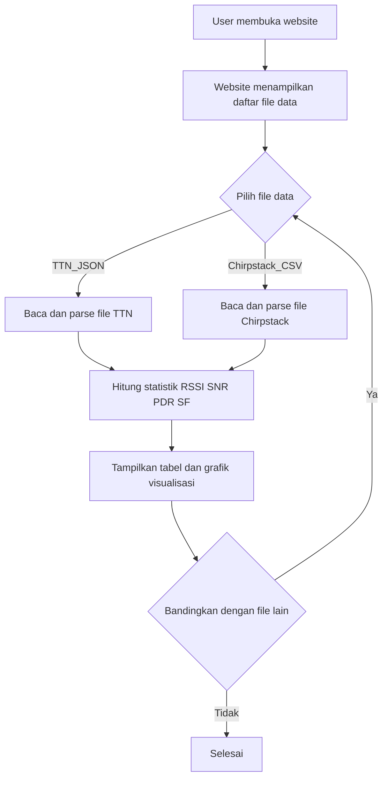

# Website Analisis Data LoRaWAN (TTN & Chirpstack)

Website ini dibuat untuk membantu analisis data hasil pengukuran sensor DHT-11 yang dikirim melalui jaringan LoRaWAN, baik menggunakan The Things Network (TTN) maupun Chirpstack. Website ini mendukung visualisasi, perhitungan statistik, dan perbandingan performa jaringan berdasarkan data yang sudah tersedia di folder.

## Fitur Utama

- **Baca Data Lokal:** Website membaca file data JSON (TTN) dan CSV (Chirpstack) yang sudah tersedia di folder proyek.
- **Statistik Deskriptif:** Menghitung rata-rata, standar deviasi, RSSI, SNR, PDR, serta distribusi Spreading Factor (SF).
- **Visualisasi:** Menampilkan grafik dan tabel data hasil pengukuran.
- **Perbandingan:** Memudahkan membandingkan performa antara TTN dan Chirpstack pada berbagai interval waktu.

## Flowchart Cara Kerja Website

## Struktur File

- `index.html` : Halaman utama website.
- `main.js` : Script utama untuk interaksi dan logika aplikasi.
- `calculator.js` : Berisi fungsi-fungsi kalkulasi statistik dan parsing data.
- `main.css` & `responsive.css` : Styling tampilan website.
- `TTN-*.json` : Data hasil pengukuran dari TTN (per interval waktu).
- `Chirpstack-*.csv` : Data hasil pengukuran dari Chirpstack (per interval waktu).

## Cara Menggunakan

1. Buka `index.html` di browser.
2. Pilih file data TTN (JSON) atau Chirpstack (CSV) yang tersedia.
3. Website akan menampilkan statistik dan visualisasi data secara otomatis.
4. Gunakan fitur perbandingan untuk melihat performa antar platform.

## Catatan

- Data TTN dan Chirpstack harus sesuai format contoh yang sudah disediakan.
- Website ini dapat dijalankan secara lokal tanpa backend/server.

> **Catatan:**  
> Flowchart sudah sesuai dengan fungsi-fungsi yang tersedia di kode (`calculator.js`). Namun, implementasi UI dan interaksi file pada web belum ada di kode (`index.html` dan `main.js` masih kosong), sehingga flowchart baru sesuai pada level desain/fungsi, bukan implementasi UI.

---

Website ini dikembangkan untuk keperluan tugas akhir/skripsi dan dapat dikembangkan lebih lanjut sesuai kebutuhan riset IoT dan LoRaWAN.
